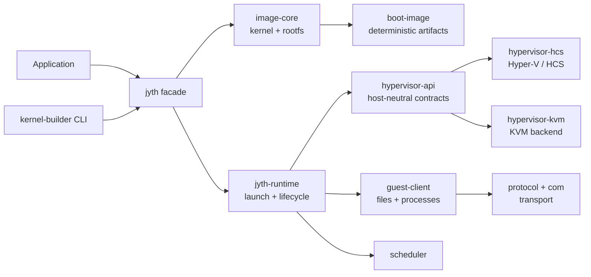

# Jyth

> A Rust-native runtime for building, booting, and operating isolated Linux workloads.

Jyth makes the path from a prepared image to a running guest process explicit. It combines image acquisition, deterministic boot-artifact assembly, host-neutral VM contracts, platform backends, guest transport, and lifecycle orchestration in one Rust workspace.

[Public project overview](https://jyth-runtime.kevinmorales-lk.chatgpt.site)

## Status

Jyth is an active **Phase Four** workspace. The current release boundary is Windows with Hyper-V/HCS; a KVM backend and host-neutral contracts are part of the workspace design. APIs and crate boundaries are still evolving.

The CI workflow currently covers formatting, strict Clippy, workspace tests, E2E target compilation, public API documentation, dependency policy, and optional live HCS gates for cold and warm runs.

## Why Jyth

Starting a VM is only one part of an isolated workload runtime. Jyth treats the surrounding lifecycle as a first-class surface:

- acquire and validate kernel/rootfs sources;
- assemble deterministic boot artifacts and guest overlays;
- select a platform backend through stable contracts;
- launch, publish, observe, and shut down a VM;
- execute guest processes and file operations through typed boundaries;
- retain cache identity, diagnostics, and cleanup behavior across the lifecycle.

## Architecture



The most important boundary rules are deliberate:

- `hypervisor-api` defines VM and backend contracts without importing HCS or KVM types.
- `jyth-runtime` owns host-side launch and shutdown orchestration through ports and contracts; it does not open sockets or inspect backend error text.
- `boot-image` consumes prepared inputs and owns deterministic kernel/initrd/overlay assembly; it does not acquire OCI sources or launch VMs.
- `guest-client` owns typed guest file/process operations over a transport contract; it does not create or close host VMs.
- The public `jyth` crate composes these adapters and exposes the application-facing builder and VM APIs.

## Workspace map

| Area | Responsibility |
| --- | --- |
| `libs/jyth` | Public facade, VM builder, platform policy, and composed adapters |
| `libs/jyth-runtime` | Launch, READY handshake, live-VM ownership, observers, and shutdown |
| `libs/hypervisor-api` | Host-neutral VM factory, instance, capability, and retry contracts |
| `libs/hypervisor-hcs` | Hyper-V/HCS backend and its lifecycle integration |
| `libs/hypervisor-kvm` | KVM backend integration |
| `libs/image-core` | Source acquisition, digests, artifact store, materialization operations, and OCI support |
| `libs/kernel` / `libs/rootfs` | Validated kernel and rootfs specifications and materialization |
| `libs/boot-image` | Guest overlays, init, CPIO assembly, derived-cache identity, and boot-artifact publication |
| `libs/guest-client` | Typed guest files, commands, process output, waits, and cleanup |
| `libs/protocol` / `libs/com` | Framing, request/reply protocols, and transport adapters |
| `libs/scheduler` | Scheduled guest actions and dispatcher coordination |
| `libs/vm-model` | Host-neutral VM, disk, network, and lifecycle data types |
| `binaries/kernel-builder` | CLI for compiling a Linux kernel inside a Jyth VM |
| `tests/architecture` | Dependency and architecture-boundary checks |
| `tests/e2e` | Black-box and live integration coverage |

## Quick start

For the supported release boundary, use Windows with Rust and Hyper-V available.

### Prerequisites

- Rust `1.95.0` or a compatible newer toolchain;
- `cargo`, `rustfmt`, and `clippy`;
- Hyper-V/HCS for live VM and kernel-builder flows;
- network access for the first uncached image/materialization operation.

Install the required Rust components if needed:

```powershell
rustup toolchain install 1.95.0
rustup component add rustfmt clippy --toolchain 1.95.0
```

Check the workspace and run the non-live test suite:

```powershell
cargo check --workspace --all-features --locked
cargo test --workspace --all-features --locked --exclude e2e-tests
```

Generate the public API documentation:

```powershell
cargo doc --workspace --no-deps --all-features --locked
```

## Kernel builder

`kernel-builder` compiles a Linux kernel through the reusable Jyth compiler adapter and copies the cached `bzImage` to the host.

Preview the plan without launching a VM or touching the cache:

```powershell
cargo run -p kernel-builder -- --version latest --no-launch
```

Run a real build:

```powershell
cargo run -p kernel-builder -- --version latest --output .\bzImage
```

The first uncached build can take several minutes because it acquires the pinned inputs and boots the compiler workload. Later runs can use the shared derived cache.

## Verification commands

These are the main local gates used by CI:

```powershell
cargo fmt --all -- --check
cargo clippy --workspace --all-targets --all-features --locked -- -D warnings
cargo test --workspace --all-features --locked --exclude e2e-tests
cargo test -p e2e-tests --no-run --jobs 1 --features kernel-builder-e2e --locked
cargo clippy -p kernel-builder --all-targets --locked -- -D warnings
cargo doc --workspace --no-deps --all-features --locked
cargo deny check
```

The live HCS gates require a self-hosted runner labeled `hyper-v`. They exercise cold and warm paths for process launch, file injection, scheduling, kernel building, runtime isolation, command security, and disk lifecycle.

## Contributing

1. Keep changes inside the crate that owns the responsibility.
2. Preserve the dependency boundaries enforced by `tests/architecture`.
3. Add or update focused tests for behavior and lifecycle edges.
4. Run formatting, Clippy, the workspace tests, and relevant E2E compilation before opening a change.
5. Do not commit generated VM/image/cache artifacts; the root `.gitignore` excludes them.

If a change affects the public facade, backend contracts, boot artifacts, or release gates, describe the compatibility impact in the change summary.

## License

Jyth is distributed under the [MIT License](LICENSE).
